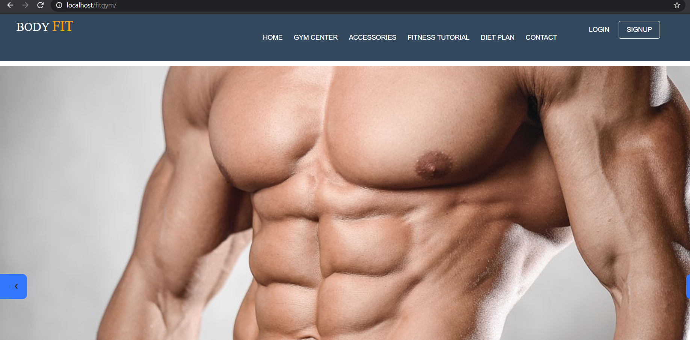
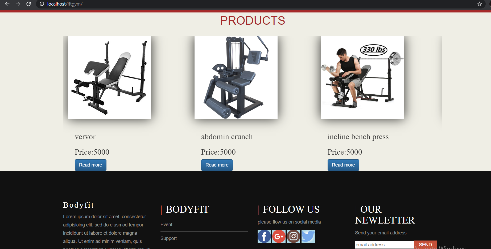
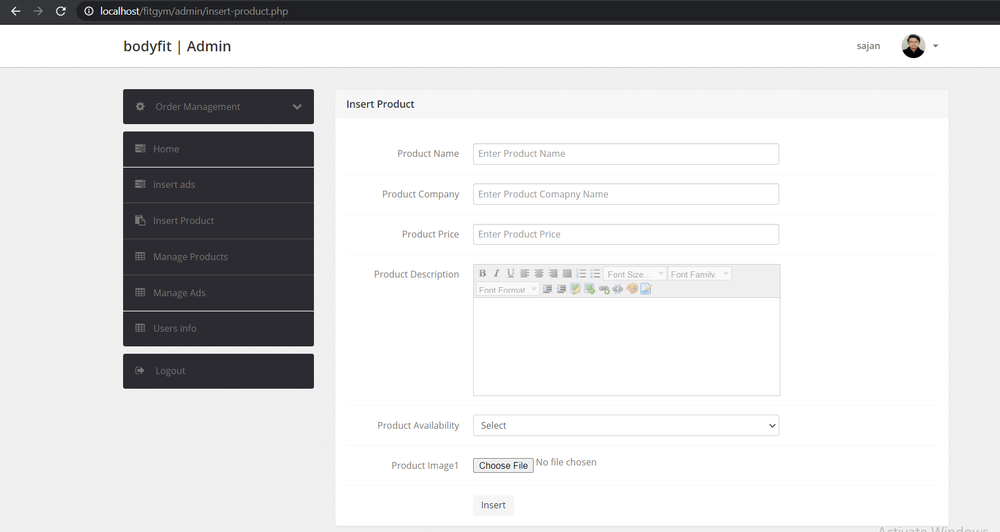
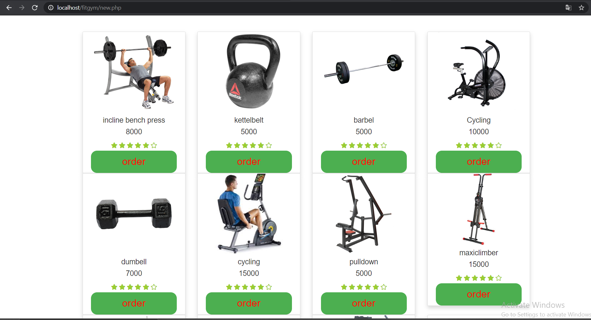
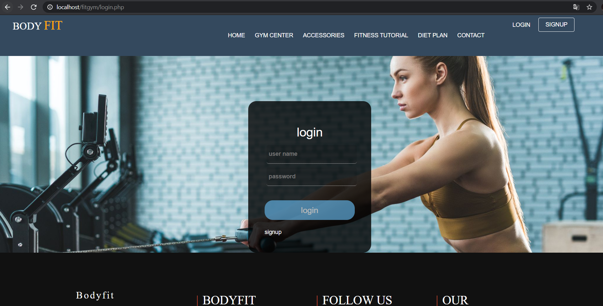
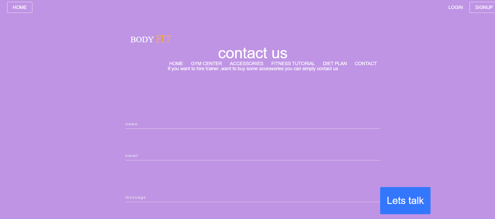

# simple-website

## Prerequisite:
1.XAMPP \
2.Decent browser

## Setup:
a.download or clone the repository in this path xampp>htdocs  
b.export file body.sql inside localhost>phpmyadmin

path to landing page http://localhost/fitgym/index.php  
path to admin page http://localhost/fitgym/admin (username-sajan password-test@123) 
new admins can be added directly in database (for password use md5 hash)`

## landing page

## admin pannel

## cart

## login

## contact

